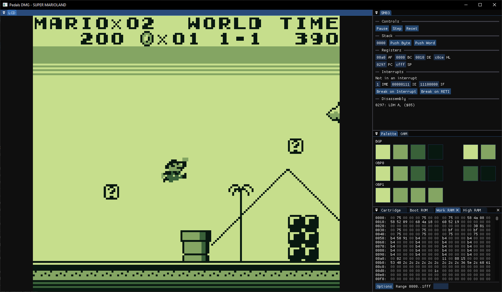

## Pedals DMG
Pedals DMG is yet another GameBoy emulator written in C++.

## Tested Games
- [x] Dr. Mario
- [x] Super Mario Land
- [x] Tetris
- [ ] Pokémon Red (PPU window code is very broken)

## Working features
- CPU passes blargg's ``cpu_instrs`` and ``instr_timing`` tests
- PPU works well enough to play simpler games
- MBC1 should be fully working
- MBC3 works but has no RTC
- Debug UI in ImGui

## Running the emulator
Get a copy of ``dmg_boot.bin`` and place it in the same directory as the emulator executable.

Then, run the emulator executable and a file picker should pop up. Select any ``.gb`` file to (try) run it.

## Compiling the emulator
The emulator uses CMake and vcpkg to build.

Set the environment variable ``VCPKG_ROOT`` to the root of your vcpkg installation, then build as you would any other CMake project.

## Resources
### General
- https://gbdev.io/pandocs
- Code from other emulators! (especially SameBoy)

### CPU
- https://rgbds.gbdev.io/docs/v0.9.2/gbz80.7
- https://gbdev.io/gb-opcodes/optables
- https://github.com/robert/gameboy-doctor

### PPU
- https://github.com/mattcurrie/dmg-acid2
- https://hacktix.github.io/GBEDG/ppu
